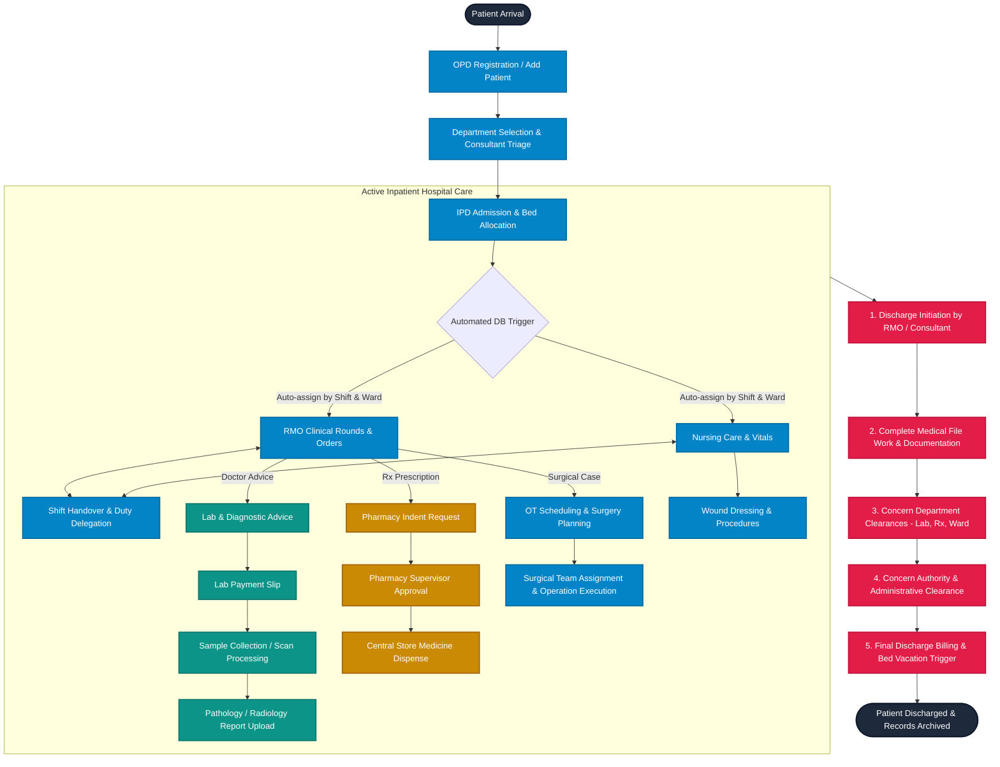
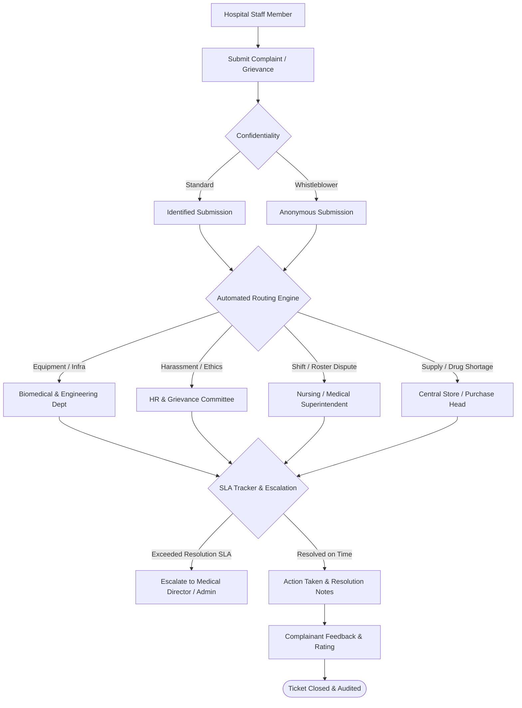
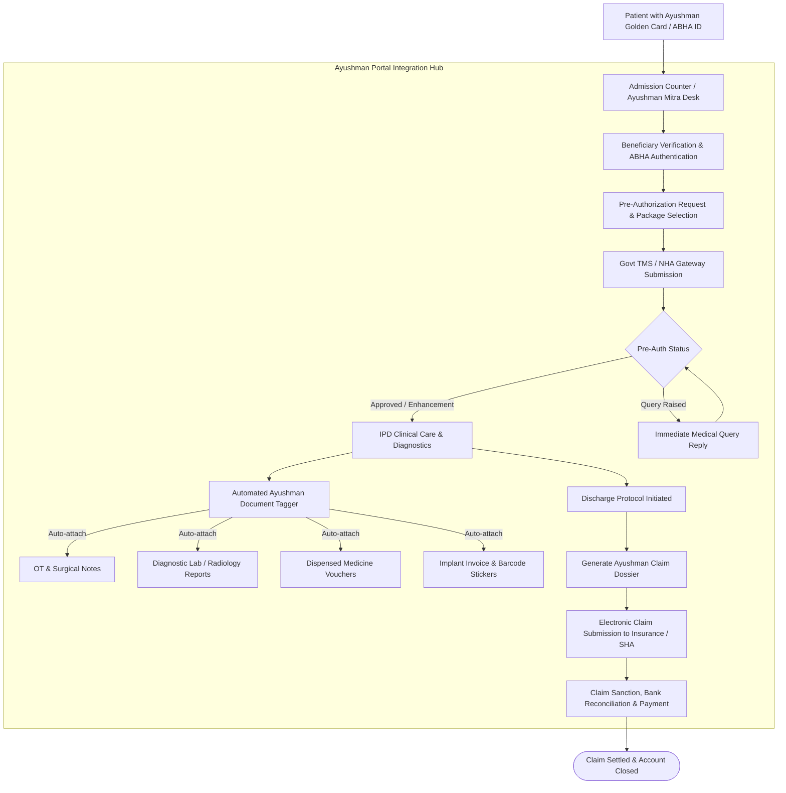

# Hospital Management Information System (HMIS)
## Complete System Architecture, Operational Workflows, Departmental Management & Roadmap

---

## 1. Executive Overview

The **Hospital Management Information System (HMIS)** is a mission-critical, enterprise-grade clinical and administrative management platform engineered for mid-to-large multi-speciality hospital operations. 

The system centralizes the end-to-end operational lifecycle of hospital care—from initial outpatient (OPD) registration and inpatient (IPD) admission, real-time bed management, computerized doctor and nursing task dispatching, diagnostic laboratory workflows, and pharmacy store distribution, through to multi-departmental clearance and final discharge settlement.

```
   ┌──────────────────────────────────────────────────────────────────────────────────┐
   │                       HOSPITAL MANAGEMENT SYSTEM (HMIS)                          │
   └────────────────────────────────────────┬─────────────────────────────────────────┘
                                            │
         ┌──────────────────────────────────┼──────────────────────────────────┐
         ▼                                  ▼                                  ▼
┌──────────────────┐               ┌──────────────────┐               ┌──────────────────┐
│  CLINICAL & CARE │               │ DIAGNOSTICS & RX │               │   ADMIN & OPS    │
├──────────────────┤               ├──────────────────┤               ├──────────────────┤
│ • OPD & IPD Adm. │               │ • Lab (Pathology)│               │ • Floor/Bed Mgmt │
│ • Doctor (RMO)   │               │ • Radiology (Xray│               │ • 3-Shift Roster │
│ • Nurse Station  │               │   CT Scan, USG)  │               │ • User RBAC      │
│ • OT Surgery     │               │ • Pharmacy Store │               │ • Multi-Stage    │
│ • Wound Dressing │               │ • Indent Workflow│               │   Discharge      │
└──────────────────┘               └──────────────────┘               └──────────────────┘
```

### Key Technical Characteristics
- **Frontend Stack**: Built with React 18, Vite, React Router v6, Tailwind CSS, Lucide Icons, Ant Design UI primitives, and TanStack Virtual/Query for high-throughput UI rendering.
- **Backend & Database Engine**: Powered by PostgreSQL / Supabase with real-time WebSocket subscriptions, Row-Level Security (RLS), and custom database triggers.
- **Atomic Concurrency & SLA Tracking**: Implements structured milestone tracking (`planned1`–`planned5`, `actual1`–`actual5`, `delay`) across all clinical activities to measure operational turnaround times and staff accountability.
- **High-Performance Aggregations**: High-speed database-level Remote Procedure Calls (`get_dashboard_stats`) compress large multi-table aggregations (~15MB down to ~2KB) for real-time executive dashboarding.

---

## 2. System Flow & Operational Workflows

The platform operates around coordinated workflows ensuring patient care continuity and inter-departmental synchronization.



### Detailed Operational Stages

#### Stage 1: Registration, Triage & IPD Admission
1. **Front-Desk Intake**: Patient details are captured with automated validation (10-digit mobile number enforcement, age calculation, address, emergency contact/next-of-kin).
2. **Category Assignment**: Patient is mapped to an administrative billing category: `General`, `Private`, `VIP`, `Insurance`, `Corporate`, `Ayushman (PM-JAY)`, or `GJAY`.
3. **Bed Allocation**: Dynamic floor and bed picker assigns vacant beds across wards (Male General, Female General, General 5th Floor, ICU, HDU, PICU, NICU, Private). Database-level constraints prevent double-booking and atomic transfers free previous beds.
4. **Trigger Generation**: Upon IPD record insertion, automated PostgreSQL triggers (`fn_create_nurse_tasks`, `baby_received_rmo_task_trigger`) inspect the active shift roster and ward assignments, automatically dispatching admission assessment tasks to on-duty staff.

#### Stage 2: Inpatient Care, Task Management & Handovers
1. **Resident Medical Officer (RMO)**:
   - Evaluates patients, logs diagnosis, clinical assessments, and ongoing treatment orders.
   - Generates diagnostic investigations, surgical referrals, and medication prescriptions.
   - Monitors individual workload via the **RMO Task List** and **RMO Score Dashboard**.
2. **Nurse Station & Patient Care**:
   - Nurses view ward-specific tasks (vitals monitoring, IV infusions, scheduled drug administration, catheter care).
   - Integrated **Patient Care Dashboard (PC Dashboard)** displays ward progress.
   - **Shift Handover Module**: Enables seamless transition across Shift A (Morning), Shift B (Evening), and Shift C (Night), allowing re-delegation of open tasks with audit traceability (`delegated_from`).
   - Dedicated **Wound Dressing Module** tracks dressing changes, wound conditions, and consumables used.

#### Stage 3: Operation Theatre (OT) Management
1. **Surgical Scheduling**: Clinical teams assign OT dates, surgery slots, and procedures for surgical cases.
2. **Team Allocation**: Designates Lead Surgeon, Anesthetist, RMO, OT Staff Nurse, and Circulating Staff.
3. **Tracking**: Captures pre-operative readiness, surgery progress timestamps, and post-operative recovery transfer back to designated recovery wards or ICU.

#### Stage 4: Diagnostics (Laboratory & Radiology)
1. **Doctor Advice**: Test advice is entered directly into the system for Pathology or Radiology (X-Ray, CT Scan, Ultrasound).
2. **Billing & Verification**: Lab payment slips are generated; tests are validated against payment or billing categories.
3. **Sample Reception & Scanning**: Phlebotomy/lab marks samples as received with exact timestamps.
4. **Result Entry & Report Dispatch**: Pathologists and Radiologists enter findings and attach digital reports (`report_url`), immediately accessible within the patient's unified record.

#### Stage 5: Pharmacy & Store Distribution
1. **Patient Indents**: Medication requests raised by nursing or doctors against active IPD admissions.
2. **Departmental Indents**: Emergency stock, ward trays, and consumable requisitions placed by ward supervisors.
3. **Approval & Dispensing Workflow**: Pharmacists review indents, verify stock availability, validate clinical authorizations, approve requests, and dispense supplies.
4. **Store Out Tracker**: Tracks material issues and ward allocations by cost heads and indenter names.

#### Stage 6: The 5-Gatekeeper Discharge Workflow
Discharges follow a strict multi-tier verification process:
1. **Discharge Initiation (`discharge-initiation`)**: Initiated by treating doctor or RMO with clinical summary notes.
2. **Complete File Work (`discharge-complete-file`)**: Verification of case sheets, consent forms, surgical notes, and test records.
3. **Concern Department Clearance (`discharge-concern-department`)**: Confirmation from Pharmacy (no unreturned medications), Laboratory (all reports closed), and Nursing (no unreturned equipment or open tasks).
4. **Concern Authority Clearance (`discharge-concern-authority`)**: Administrative, TPA insurance, corporate, or management clearance.
5. **Discharge Bill Settlement (`discharge-bill`)**: Final invoicing, advance adjustment, settlement, and automatic bed de-allocation trigger (`set_bed_status_null_on_actual1`) setting the bed back to vacant.

---

## 3. Departments & Functional Coverage

| Department | Module Key | Core Functions & Responsibilities | Key Database Tables |
|---|---|---|---|
| **Front Desk & Reception** | `admission`, `ipd` | Patient registration, UHID issuance, demographic capture, department assignment, emergency triage. | `patient_admission`, `ipd_admissions` |
| **Inpatient Department (IPD)** | `ipd-admission`, `masters-floor-bed` | Bed allocation, ward transfers, patient category management, admission tariff setup, inpatient tracking. | `ipd_admissions`, `all_floor_bed` |
| **Resident Medical Officers (RMO)** | `rmo-assign-task`, `rmo-task-list`, `rmo-score-dashboard` | Daily clinical rounds, doctor task allocation, clinical notes, patient progress monitoring, RMO score dashboard. | `rmo_assign_task`, `master`, `pre_defined_task` |
| **Nursing Station** | `nurse-station`, `pc-dashboard`, `shift-handover` | Ward nursing, medication administration, vitals monitoring, shift task delegation, nursing SLA scorecards. | `nurse_assign_task`, `shift_handover`, `congratulations_posts` |
| **Operation Theatre (OT)** | `ot-assign-ot-time` | Surgery scheduling, table bookings, surgical team allocation (Surgeon, Anesthetist, RMO, Staff), post-op handover. | `ot_information`, `surgical_data` |
| **Pathology & Lab Diagnostics** | `lab-advice`, `lab-payment-slip`, `lab-receive-sample`, `lab-pathology`, `lab-workflow` | Lab test booking, slip generation, sample collection barcoding, biochemical result entry, report attachments. | `lab`, `investigation` |
| **Radiology & Imaging** | `lab-xray`, `lab-ct-scan`, `lab-usg` | Diagnostic imaging appointments, scan processing, radiologist interpretation, report uploads. | `lab`, `investigation` |
| **Pharmacy & Central Store** | `pharmacy-indent`, `pharmacy-departmental-indent`, `pharmacy-approval`, `pharmacy-store`, `store-out-tracker` | Patient indents, departmental ward stocks, multi-level indent approval, central drug inventory, store out tracking. | `pharmacy`, `departmental_pharmacy_indent`, `store_out`, `medicine` |
| **Wound Care & Dressing** | `patient-profile/:id/dressing` | Post-surgical dressing changes, wound status tracking, dresser task assignment, procedural notes. | `dressing` |
| **Discharge & Billing** | `discharge-patient`, `discharge-initiation`, `discharge-complete-file`, `discharge-concern-department`, `discharge-concern-authority`, `discharge-bill`, `discharge-workflow-dashboard` | Multi-step discharge pipeline, inter-departmental clearances, final itemized invoices, advance adjustments, bed release. | `discharge`, `ipd_admissions`, `all_floor_bed` |
| **Human Resources & Rostering** | `roster`, `masters-all-staff`, `masters-doctors` | Staff directory, doctor profiles, 3-shift duty rosters (Shift A, B, C), staff leaves management (nurse, rmo, ot). | `roster`, `all_staff`, `doctors`, `leave`, `ward_config` |
| **Ayushman & Govt. Scheme Portal** | `ayushman-portal` | Single-page scheme tracker for BSKY, Ayushman Bharat, GJAY, Private, and ESIC patients with planned/actual timestamps and up to 20 bucket photos per admission. | `ayushman_portal`, `ayushman_portal_view`, `ayushman_photos` (bucket) |
| **Hospital Administration & IT** | `dashboard`, `masters-manage-users`, `masters-delete-patient`, `masters-department`, `masters-tests` | Executive metrics, user accounts & Role-Based Access Control (RBAC), audit logging, master catalog configuration. | `users`, `patient_deletion_log`, `master` |

---

## 4. Comprehensive Inventory: What the System Manages

### A. Patient & Clinical Management
- **Central Patient Registry**: Unique admission IDs, demographic profiles, attender/kin contact info, and medical case histories.
- **Unified 360° Patient Profile (`/admin/patient-profile/:id`)**:
  - Comprehensive clinical summary with real-time status.
  - Sub-views for **RMO Tasks**, **Nursing Tasks**, **Lab Tests**, **Pharmacy Indents**, **OT Procedures**, **Dressing History**, and **Assigned Checkups**.
- **Bed & Occupancy Tracking**:
  - Floor-by-floor and ward-by-ward live layout.
  - Real-time occupancy state: Vacant vs. Occupied.
  - Automatic atomic bed release upon discharge finalization or patient transfer.
- **Automated Task Assignment Engine**:
  - Background database functions map new admissions directly to on-duty rostered nurses and RMOs based on active shift and ward.

### B. Diagnostic & Laboratory Operations
- **Diagnostic Catalog**: Comprehensive master directory of Pathology tests, Radiography (X-Ray), Computed Tomography (CT), and Ultrasound (USG).
- **Turnaround Time (TAT) Management**: Strict tracking across 4 milestones:
  - `planned1` / `actual1`: Advice generated to Payment slip created.
  - `planned2` / `actual2`: Sample collection/reception.
  - `planned3` / `actual3`: Result analysis & report upload.
  - `planned4` / `actual4`: Clinician verification.
- **Workflow Dashboards**: High-level visual pipeline tracking pending, in-progress, and completed investigations.

### C. Pharmacy & Material Supply Chain
- **Dual Indent Structure**:
  - *Patient Indents*: Linked to active IPD bed, patient diagnosis, and treating physician.
  - *Departmental Indents*: Bulk requisitions for ward emergency stocks, ICU trays, and dressings.
- **Approval & Verification**: Dedicated pharmacist approval step with digital slip attachment and batch verification.
- **Store Out Material Tracker**: Inventory consumption ledger tracking medicine disbursements, ward transfers, and cost head allocations.

### D. Workforce, Rostering & Duty Governance
- **Three-Shift Operational Model**:
  - **Shift A**: Morning (08:00 AM – 02:00 PM)
  - **Shift B**: Afternoon/Evening (02:00 PM – 08:00 PM)
  - **Shift C**: Night (08:00 PM – 08:00 AM)
- **Interactive Drag-and-Drop Roster**: Desktop and touch-optimized roster management for Nurses, RMOs, and OT Staff across all hospital wards.
- **Leave Management System**: Daily leave logging preventing automated task assignment to absent personnel.
- **Shift Handover Protocol**: Clinical delegation tool allowing outgoing shift personnel to transfer pending tasks to incoming staff with complete audit history.
- **Staff Performance & Recognition**: Real-time score dashboards measuring completion percentages, delay metrics, and **Congratulations Posts** celebrating top performers.

### E. Financial & Administrative Control
- **Tariff & Advance Tracking**: Room tariffs, doctor visit fees, surgical package fees, advance deposits, and payment categorization.
- **Audit-Logged Patient Deletion Tool**: Secure administrative utility to purge invalid admissions while recording cryptographic deletion summaries (`patient_deletion_log`).
- **Granular Role-Based Access Control (RBAC)**: Custom permission sets controlling navigation, read/write actions, and administrative privileges for every system user.

---

## 5. Planned & Under-Building Systems

To further elevate hospital operational efficiency, employee satisfaction, and government healthcare compliance, the following two major modules are currently **under building and planned for rollout**:

```
┌──────────────────────────────────────────────────────────────────────────────────┐
│                           UPCOMING / UNDER-BUILDING MODULES                      │
├────────────────────────────────────────┬─────────────────────────────────────────┤
│    1. STAFF COMPLAINT SYSTEM           │     2. AYUSHMAN PORTAL (AB-PM-JAY)      │
│    (Internal Grievance & SLA Engine)   │     (Govt. Health Scheme Integration)   │
└────────────────────────────────────────┴─────────────────────────────────────────┘
```

---

### 5.1 Staff Complaint & Grievance Management System

#### Purpose & Problem Statement
In high-stress hospital environments, operational bottlenecks (broken medical equipment, medication shortages, inter-departmental conflicts, shift scheduling disputes, harassment, or unsafe conditions) often go unaddressed due to lack of a structured, confidential reporting mechanism. 

The **Staff Complaint System** provides a formal, auditable, and SLA-tracked grievance reporting channel for all hospital personnel (Nurses, RMOs, OT Technicians, Ward Attendants, Pharmacists, and Administrative Staff).



#### Key Capabilities & Features
1. **Multi-Category Incident Reporting**:
   - **Infrastructure & Biomedical**: Defective ventilators, suction machines, AC failure in ICU, plumbing, electrical issues.
   - **Supply & Stock Shortages**: Urgent shortage of life-saving drugs, surgical gloves, PPE, IV sets.
   - **Workplace & Behavioral Grievances**: Inter-departmental disputes, harassment, unprofessional conduct, safety concerns.
   - **Rostering & Shift Inequities**: Unfair shift rotations, continuous night duties, unresolved leave requests.
2. **Confidentiality & Whistleblower Protection**:
   - Option to submit complaints **anonymously** or with verified staff credentials.
   - Restricts ticket visibility exclusively to the Grievance Redressal Committee and Medical Director.
3. **Automated SLA Routing & Escalation Matrix**:
   - Priority Levels: `Critical (4-hour SLA)`, `High (12-hour SLA)`, `Medium (24-hour SLA)`, `Low (48-hour SLA)`.
   - Automatic escalation notifications sent to the Medical Superintendent if tickets remain pending beyond target thresholds.
4. **Resolution Verification & Feedback Loop**:
   - Assigned resolution authority must submit proof of resolution (notes, repair images, vendor challans).
   - Complainant receives instant resolution alerts and rates the resolution before final ticket closure.
5. **Grievance Analytics & Heatmaps**:
   - Management dashboard tracking recurring equipment failures, high-stress wards, resolution turnaround times, and departmental health indexes.

#### Planned Database Architecture (`staff_complaints`)
```sql
CREATE TABLE public.staff_complaints (
  id uuid NOT NULL DEFAULT gen_random_uuid(),
  ticket_no text UNIQUE NOT NULL,
  timestamp timestamp with time zone DEFAULT now(),
  staff_id bigint REFERENCES public.all_staff(id),
  staff_name text,
  is_anonymous boolean DEFAULT false,
  department text NOT NULL,
  ward_location text,
  category text NOT NULL, -- 'Biomedical Equipment', 'Supply Shortage', 'Workplace/HR', 'Roster Dispute', 'Safety'
  severity text NOT NULL, -- 'Critical', 'High', 'Medium', 'Low'
  subject text NOT NULL,
  description text NOT NULL,
  attachments jsonb, -- Array of image/PDF URLs
  status text DEFAULT 'Open', -- 'Open', 'Under Review', 'In Progress', 'Resolved', 'Escalated', 'Closed'
  assigned_to text,
  target_resolution timestamp with time zone,
  actual_resolution timestamp with time zone,
  resolution_notes text,
  resolution_proof_url text,
  satisfaction_rating integer, -- 1 to 5 stars
  feedback_comment text,
  created_at timestamp with time zone DEFAULT now(),
  updated_at timestamp with time zone DEFAULT now(),
  CONSTRAINT staff_complaints_pkey PRIMARY KEY (id)
);
```

---

### 5.2 Ayushman Bharat (AB-PM-JAY) & State Scheme Integration Portal

#### Purpose & Problem Statement
Government-sponsored healthcare schemes—predominantly **Ayushman Bharat Pradhan Mantri Jan Arogya Yojana (AB-PM-JAY)** and State schemes (e.g., Mukhyamantri Amrutum, GJAY)—account for a substantial share of patient volume. However, managing scheme patients through fragmented external government portals leads to claim delays, unbilled treatments, pre-authorization rejections, and settlement losses.

The **Ayushman Portal** integrates directly into the HMIS, streamlining scheme validation, automated pre-authorization, real-time in-treatment documentation, and one-click claim dossier compilation.



#### Key Capabilities & Features
1. **Beneficiary Eligibility & ABHA Verification**:
   - Integration with Ayushman Bharat Health Account (ABHA) and PM-JAY Golden Card verification.
   - Instant eligibility checks, family wallet balance inquiry, and beneficiary identity confirmation (Aadhaar OTP / biometric match).
2. **Master Package & Procedure Mapping**:
   - In-app NHA (National Health Authority) standard procedure and specialty package tariff list.
   - Prevents booking procedures outside sanctioned scheme packages and automatically checks pre-requisite diagnostic criteria.
3. **Automated Pre-Authorization & Enhancement Workflow**:
   - Captures clinical justifications, clinical photos, admission notes, and preliminary diagnostic scans required for pre-auth.
   - Monitors pre-auth approval status (`Pending`, `Approved`, `Query Raised`, `Rejected`) in real-time without leaving the HMIS.
   - Supports mid-treatment package enhancement requests for prolonged ICU stays or surgical complications.
4. **Smart Document Tagger for Scheme Compliance**:
   - Ayushman claim settlements require strict supporting documents: pre-op photos, post-op photos, signed consent forms, implant barcode stickers, daily doctor notes, and diagnostic film images.
   - The module automatically tags existing HMIS records (Lab reports, OT notes, Pharmacy bills, Discharge summaries) into the Ayushman Claim Dossier.
5. **Electronic Claim Dossier & Settlement Tracker**:
   - One-click export of complete claim packages formatted for the National Health Authority Transaction Management System (TMS).
   - Real-time tracking of State Health Agency (SHA) / TPA queries, reducing claim rejection rates.
   - Bank settlement and deduction ledger comparing billed package costs against actual received credits.

#### Planned Database Architecture (`ayushman_claims`)
```sql
CREATE TABLE public.ayushman_claims (
  id uuid NOT NULL DEFAULT gen_random_uuid(),
  claim_number text UNIQUE NOT NULL,
  ipd_number text NOT NULL REFERENCES public.ipd_admissions(ipd_number),
  admission_no text,
  patient_name text NOT NULL,
  abha_id text,
  golden_card_no text NOT NULL,
  scheme_name text NOT NULL DEFAULT 'AB-PM-JAY', -- 'AB-PM-JAY', 'GJAY', 'State Scheme'
  package_category text NOT NULL,
  package_code text NOT NULL,
  package_name text NOT NULL,
  sanctioned_amount numeric(12,2) DEFAULT 0,
  enhancement_amount numeric(12,2) DEFAULT 0,
  preauth_status text DEFAULT 'Pending', -- 'Pending', 'Approved', 'Query', 'Rejected'
  preauth_approval_number text,
  preauth_approved_at timestamp with time zone,
  clinical_documents jsonb, -- Array of { title, type, url, timestamp }
  implant_stickers jsonb,   -- Array of implant barcodes & batch invoices
  tms_case_id text,
  claim_submission_date timestamp with time zone,
  claim_status text DEFAULT 'Draft', -- 'Draft', 'Submitted', 'Query_Pending', 'Approved', 'Disbursed', 'Deducted'
  approved_claim_amount numeric(12,2),
  deduction_amount numeric(12,2),
  deduction_reason text,
  bank_utr_number text,
  payment_disbursed_at timestamp with time zone,
  created_at timestamp with time zone DEFAULT now(),
  updated_at timestamp with time zone DEFAULT now(),
  CONSTRAINT ayushman_claims_pkey PRIMARY KEY (id)
);
```

---

## 6. System Architecture & Technical Specifications

```
┌──────────────────────────────────────────────────────────────────────────────────┐
│                                 HMIS TECH STACK                                  │
├──────────────────────┬───────────────────────────────────────────────────────────┤
│ Frontend Framework   │ React 18 (SPA) with Vite Build Engine                     │
│ Styling & Design     │ Tailwind CSS, Lucide Icons, Ant Design primitives         │
│ State & Virtualization│ TanStack React Query v5, TanStack Virtual v3              │
│ Routing & Security   │ React Router v6, ProtectedRoute RBAC wrapper              │
│ Backend Infrastructure│ Supabase Platform (PostgreSQL 15+, Auth, Realtime Engine)  │
│ Database Logic       │ Pl/pgSQL Functions, Triggers, RPC Aggregates, Trigrams    │
│ Reporting & Documents│ jsPDF, jsPDF-AutoTable for dynamic slips and summaries    │
└──────────────────────┴───────────────────────────────────────────────────────────┘
```

### Key Engineering Optimizations
1. **High-Performance RPC Summaries**:
   - `get_dashboard_stats()` executes all analytical counts, gender distributions, and ward occupancy calculations inside a single database query, avoiding multi-megabyte frontend table downloads.
2. **Atomic IPD Bed Updates**:
   - Triggers synchronously sync bed occupancy status (`all_floor_bed.status = 'occupied'`) upon patient admission and automatically vacate the bed (`status = null`) upon completion of final discharge (`actual1` timestamp).
3. **Least-Busy Staff Task Auto-Dispatch**:
   - When a patient is admitted to a ward, database triggers query `nurse_assign_task` via index `idx_nat_assign_lookup` to identify which on-duty rostered nurse has the lowest pending load and automatically delegates the task in under **3 milliseconds**.
4. **Data Grid Virtualization**:
   - TanStack Virtual powers the admissions, patient profile, and task lists, enabling smooth 60fps scrolling across 10,000+ patient records without browser memory bottlenecks.
5. **Strict Data Input Sanitization**:
   - Enforced client-side input sanitization across all forms: 10-digit numeric constraint on all phone/mobile fields with automatic suppression of browser autocomplete interference.

---

## 7. Roadmap & Future Evolution

```
┌───────────────────────────────────────────────────────────────────────────────────────┐
│                                  HMIS PRODUCT ROADMAP                                 │
├────────────────────┬──────────────────────────────────────────────────────────────────┤
│ CURRENT LIVE STATE │ • OPD/IPD Admissions & Bed Allocation                            │
│                    │ • RMO & Nurse Task Engines, Duty Handover                        │
│                    │ • Pathology, X-Ray, CT, USG Diagnostic Workflows                 │
│                    │ • Pharmacy & Departmental Store Out Management                   │
│                    │ • 5-Stage Inter-Departmental Discharge Clearance                 │
│                    │ • 3-Shift Drag-and-Drop Staff Roster                             │
├────────────────────┼──────────────────────────────────────────────────────────────────┤
│ IN ACTIVE BUILD    │ 🛠️ Staff Complaint & Workplace Grievance SLA Engine              │
│                    │ 🛠️ Ayushman Bharat (AB-PM-JAY) & State Scheme Integration Hub    │
├────────────────────┼──────────────────────────────────────────────────────────────────┤
│ NEXT PHASE         │ 🔮 WhatsApp Notification Bot (Discharge, Reports & Reminders)    │
│                    │ 🔮 Barcode/RFID Bedside Medication Administration (BCMA)         │
│                    │ 🔮 Tele-Consultation & Doctor Video Portal                       │
│                    │ 🔮 AI Diagnostic Summary & Clinical Escalation Warnings          │
└────────────────────┴──────────────────────────────────────────────────────────────────┘
```

---
*Document Version: 2.4*  
*Last Updated: September 2026*  
*Application: Hospital Management Information System (MIS / HMIS)*
